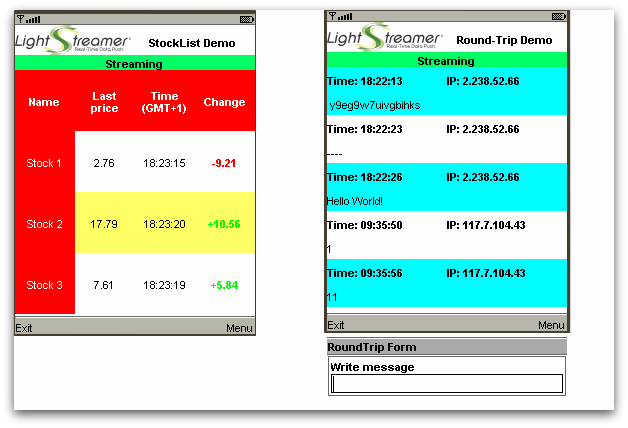

# Lightstreamer - Basic Stock-List and Round-Trip Demo - Java ME Client
<!-- START DESCRIPTION lightstreamer-example-stocklist-client-midlet -->

This project contains a full example of a Midlet Java application that employs the [Lightstreamer JAVA ME client library](https://lightstreamer.com/api/ls-javame-client/latest/index.html).

## Live Demo

 
### [ View live demo](http://demos.lightstreamer.com/midlet/lsmidlet_midp.jad) 

## Details

This Java midlet contains two different screens: one with three stock quotes from the [Lightstreamer - Stock-List Demos - HTML Clients](https://github.com/Lightstreamer/Lightstreamer-example-Stocklist-client-javascript), the other with four items from the [Lightstreamer - Round-Trip Demo - HTML Client](https://github.com/Lightstreamer/Lightstreamer-example-RoundTrip-client-javascript).
This app uses the <b>Java ME Client API for Lightstreamer</b> to handle the communications with Lightstreamer Server. 

You will see the yellow flashing cells of the Stock-List Demos. Use the Option menu to switch to the other demo, where you can see the values of some items of the Round-Trip Demo updated in real-time. To publish new values, use the Option menu.

You can open the [Lightstreamer - Round-Trip Demo - HTML Client](https://github.com/Lightstreamer/Lightstreamer-example-RoundTrip-client-javascript) on a PC browser and see the values synchronized with the mobile phone.

<!-- END DESCRIPTION lightstreamer-example-stocklist-client-midlet -->

## Build

If you want to skip the build and deploy processes of this demo, please note that you can click the image or link above to download a MIDP 2.0 `.jad` file to your phone. As an alternative, point your mobile browser to the URL, to choose between `.jad` and `.jar`: http://demos.lightstreamer.com/midlet/ .
Once installed on your phone, run the midlet, allow the network connections, choose the access point id prompted, and wait for the connection to be established (as shown in the top green bar). 

Otherwise, if you want to procede with the compilation of own version of this demo, please consider that this example is comprised of the following folders:
* `src` 
  Contains the sources to build the java application.

* `res` 
  Contains the images needed to the demo.
  
* `lib` 
  Drop here the `ls-j2me-client.jar` from the Lighstreamer SDK for Java ME Clients, to be used for the build process and execution.

### Deploy
  
By the current configuration, specified in `LightstreamerDemoMidlet.java` and used by the provided precompiled files; the demo tries to connect to the demo server currently running on Lightstreamer website.
The demo can be reconfigured and recompiled to connect to the local installation of Lightstreamer Server. Only the host name and the port number have to be changed in the source code.
The example requires that the [QUOTE_ADAPTER](https://github.com/Lightstreamer/Lightstreamer-example-Stocklist-adapter-java) and [ROUNDTRIP_ADAPTER](https://github.com/Lightstreamer/Lightstreamer-example-RoundTrip-adapter-java) have to be deployed in your local Lightstreamer server instance;
the [LiteralBasedProvider](https://github.com/Lightstreamer/Lightstreamer-example-ReusableMetadata-adapter-java) is also needed, but it is already provided by Lightstreamer server. 

## See Also

### Lightstreamer Adapters Needed by This Demo Client
<!-- START RELATED_ENTRIES -->

* [Lightstreamer - Stock-List Demo - Java Adapter](https://github.com/Lightstreamer/Lightstreamer-example-Stocklist-adapter-java)
* [Lightstreamer - Reusable Metadata Adapters - Java Adapter](https://github.com/Lightstreamer/Lightstreamer-example-ReusableMetadata-adapter-java)
* [Lightstreamer - Round-Trip Demo - Java Adapter](https://github.com/Lightstreamer/Lightstreamer-example-RoundTrip-adapter-java)

<!-- END RELATED_ENTRIES -->

### Related Projects

* [Lightstreamer - Stock-List Demos - HTML Clients](https://github.com/Lightstreamer/Lightstreamer-example-Stocklist-client-javascript)
* [Lightstreamer - Basic Stock-List Demo - jQuery (jqGrid) Client](https://github.com/Lightstreamer/Lightstreamer-example-StockList-client-jquery)
* [Lightstreamer - Stock-List Demo - Dojo Toolkit Client](https://github.com/Lightstreamer/Lightstreamer-example-StockList-client-dojo)
* [Lightstreamer - Basic Stock-List Demo - Java SE (Swing) Client](https://github.com/Lightstreamer/Lightstreamer-example-StockList-client-java)
* [Lightstreamer - Basic Stock-List Demo - .NET Client](https://github.com/Lightstreamer/Lightstreamer-example-StockList-client-dotnet)
* [Lightstreamer - Round-Trip Demo - HTML Client](https://github.com/Lightstreamer/Lightstreamer-example-RoundTrip-client-javascript)

## Lightstreamer Compatibility Notes

* Compatible with Lightstreamer Java ME Client API v. 3.2.1 or newer.
* Ensure that Java ME Client API is supported by Lightstreamer Server license configuration.
